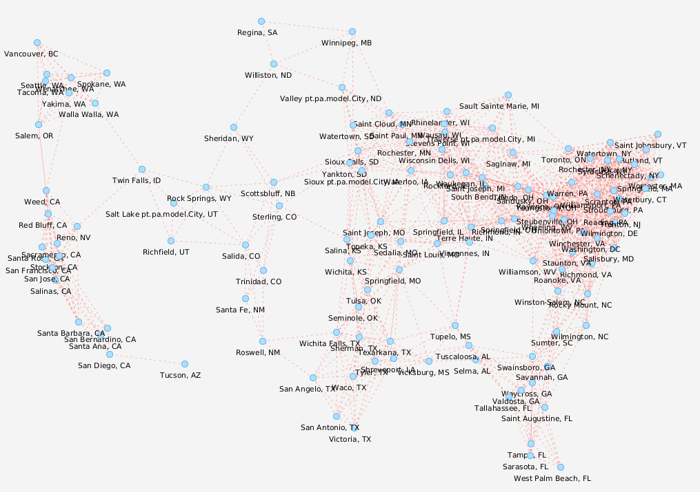

# Projeto PA 2021/22 - Época Normal

O enunciado relativamente ao projeto encontra-se no Moodle.

Este template *IntelliJ* deve servir de base de desenvolvimento para este trabalho e o seu versionamento interno dentro de cada grupo feito através do *Git*.

## Estrutura de ficheiros/pastas

- `/dataset` - contém os *datasets* a importar pela aplicação
- `/src` - contém o código-fonte da aplicação
    - `com.brunomnsilva.smartgraph` - *package* que contém a biblioteca [JavaFXSmartGraph](https://github.com/brunomnsilva/JavaFXSmartGraph). Não é esperado que tenha de fazer modificações a estas classes.
    - `pt.pa` - *package* principal da aplicação.
        - `*.graph` - *package* que contém o ADT Graph e uma implementação funcional baseada em "lista de arestas".
        - `*.model` - *package* que contém o modelo de classes da aplicação desenvolvida.
        - `*.view` - *package* que contém as classes gráficas da aplicação desenvolvida.
    - `Main.java` - classe que contém o ponto de entrada para a aplicação.
- `/test` - (a criar) contém os testes unitários da aplicação
- `smartgraph.css` - *stylesheet* utilizado pela biblioteca JavaFXSmartGraph (pode alterar)
- `smartgraph.properties` - *propriedades* utilizadas pela biblioteca JavaFXSmartGraph (não é necessário alterar, já contém definições adequadas)
- `README.md` - este ficheiro. Podem alterar o conteúdo, se entenderem.

## Dados para importação

Os ficheiros estão em formato de texto, emboram possam conter números; poderão existir comentários - essas linhas começam pelo caractere `"#"` e devem ser ignoradas durante a leitura.

Os *datasets* encontram-se na pasta local `dataset`, portanto qualquer ficheiro localizado nessa pasta pode ser aberto com, e.g., `new FileReader("dataset/<folder>/<file>.txt")`, sendo `<file>` o ficheiro respetivo a abrir.

Existem dois *datasets*, nomeadamente `sbg32` e `sbg128`, contendo 32 e 128 hubs respetivamente.

Cada dataset contem os seguintes ficheiros:

- `name.txt` - Nomes das cidades onde estão localizados os *hubs*;
- `weight.txt` - População das cidades onde estão localizados os *hubs*;
- `xy.txt` - Coordenadas (de ecrã) das cidades onde estão localizados os *hubs*;

- `routes_*.txt` - Matriz de distâncias das rotas entre todos os hubs - pode haver diferentes versões (sufixo) deste ficheiro, e.g., `"_1"` e `"_2"`.

### Relação da informação entre ficheiros

Os ficheiros `name.txt`, `weight.txt` e `xy.txt` contêm o **mesmo número N de entradas válidas**; cada linha respetiva contém informação de uma cidade/hub. Ou seja, a informação na linha (válida) L de um ficheiro relaciona-se com a informação da linha L de outro ficheiro.

Os ficheiros `routes_*.txt` contêm uma "matriz de distâncias" entre cidades/hubs, i.e., se houve N cidades, então esta matriz têm a dimensão NxN (e.g., ver [wikipedia](https://pt.wikipedia.org/wiki/Matriz_de_dist%C3%A2ncias)). Uma distância de 0 (zero) significa que não existe rota direta entre duas cidades/hubs.

### Exemplo de modelo importado

A título de exemplo, mostra-se o resultado esperado da importação dos dois datasets, podendo variar o 
ficheiro das rotas. Note que a disposição relativa das cidades (vértices) é um mapeamento geograficamente realista. 

### sgb32

Rotas em `routes_1.txt` (grafo bipartido - 2 componentes):


### sgb128

Rotas em `routes_1.txt` (1 componente):



Rotas em `routes_2.txt` (grafo bipartido - 3 componentes):


### Resumo do trabalho

Para inicializar o projeto implementámos a classe GraphAdjacencyList (baseado na lista de adjacencias)

Esta classe implementa a interface Graph, ou seja todas as funções da interface vao ser implementadas nesta classe.

#### GraphAdjacencyList (Class)

A classe tem um atributo privado:
```java
private Map<V, Vertex<V>> vertices;
```
- O atributo permite guardar dois vertices que estão ligados numa aresta.

O construtor que inicializa esse vertice:
```java
public GraphAdjacencyList() {
    this.vertices = new HashMap<>();
}
```
#### Classes internas:
###### MyVertex
```java
private class MyVertex implements Vertex<V>
```
Esta classe define um vertice. Tem dois atributos privados que são:
```java
private V element;
private List<Edge<E, V>> incidentEdges;
```
- O atributo element guarda um elemento do vertice
- O atributo incidentEdges guarda a lista de arestas incidentes do vertice

O construtor da classe MyVertex atribui um valor ao atributo 'element' e inicializa a lista do atributo 'incidentEdges'
```java
public MyVertex(V element) {
    this.element = element;
    this.incidentEdges = new ArrayList<>();
}
```
A Classe contem um método que devolve o atributo 'element'
```java
public V element() {
    return element;
}
```
###### MyEdge
```java
private class MyEdge implements Edge<E, V>
```
Esta classe define uma aresta. Tem um atributo privado que é:
```java
private E element;
```
- O atributo element guarda um elemento da aresta

O Construtor da classe MyEdge atribui um valor ao atributo 'element'
```java
public MyEdge(E element) {
    this.element = element;
}
```
A Classe contem dois métodos, um que devolve o atributo 'element';
```java
public E element() {
    return element;
}
```
E o outro que devolve uma lista dos vertices associados à aresta
```java
public Vertex<V>[] vertices()
```

#### Métodos da classe (GraphAdjacencyList)
```java
public boolean areAdjacent(Vertex<V> u, Vertex<V> v) throws InvalidVertexException
```
Este método verifica se as duas vertices sao adjacentes (se existe uma aresta entre 'u' e 'v'), caso um dos vertices
não exista é lançada a exceção InvalidVertexException.
```java
public int numVertices()
```
Este método devolve o número de vertices.
```java
public int numEdges()
```
Este método devolve o número de arestas.
```java
public Collection<Vertex<V>> vertices()
```
Este método vai devolver uma coleção de todos os vertices do grafo.
```java
public Collection<Edges<E, V>> edges()
```
Este método vai devolver uma coleção de todas as arestas do grafo.
```java
public Collection<Edge<E, V>> incidentEdges(Vertex<V> v) throws InvalidVertexException
```
Este método devolve uma coleção de todos os vertices que partilham uma aresta com o vertice 'v', caso o vertice 'v' não
exista é lançada a exceção InvalidVertexException.
```java
public Vertex<V> opposite(Vertex<V> v, Edge<E, V> e) throws InvalidVertexException, InvalidEdgeException
```
Este método devolve um vertice oposto ao vertice 'v' na aretas 'e', se não houver vertice 'v' lança a exceção
InvalidVertexException, caso não haja uma aresta a ligar o vertice 'v' é lançada a exceção InvalidEdgeException.
```java
public Vertex<V> insertVertex(V vElement) throws InvalidVertexException
```
Este método insere um vertice no grafo e devolve o vertice inserido, se o vertice já existir é lançada a exceção InvalidVertexException.
```java
public Edge<E, V> insertEdge(V vElement1, V vElement2, E edgeElement) throws InvalidVertexException, InvalidEdgeException
```
Este método insere uma aresta entre dois elementos de dois vertices do grafo e devolve a aresta inserida, caso um desses vertices não exista é 
lançada a exceção InvalidVertexException e se já houver uma aresta entre os dois vertices é lançada a exceção
InvalidEdgeException.
```java
public Edge<E, V> insertEdge(Vertex<V> u, Vertex<V> v, E edgeElement) throws InvalidVertexException, InvalidEdgeException
```
Este método insere uma aresta entre dois vertices do grafo e devolve a aresta inserida, caso um desses vertices não exista é
lançada a exceção InvalidVertexException e se já houver uma aresta entre os dois vertices é lançada a exceção
InvalidEdgeException.
```java
public V removeVertex(Vertex<V> v) throws InvalidVertexException
```
Este método remove um vertice do grafo, mas antes de remover o vertice, o método remove qualquer aresta incidente
associada ao vertice a ser eliminado e devolve o elemento do vertice removido, caso o vertice não exista é lançada a exceção InvalidVertexException.
```java
public E removeEdge(Edge<E, V> e) throws InvalidEdgeException
```
Este método remove uma aresta associada a dois vertices e devolve o elemento da aresta removida, caso a aresta não exista é lançada a exceção 
InvalidEdgeException.
```java
public V replace(Vertex<V> v, V newElement) throws InvalidVertexException
```
Este método altera o elemento de um vertice do grafo e devolve o elemento do vertice que foi alterado, caso o vertice
não exista é lançada a exceção InvalidVertexException.
```java
public E replace(Edge<E, V> e, E newElement) throws InvalidEdgeException
```
Este método altera o elemento de uma aresta do grafo e devolve o elemento da aresta que foi alterado, caso a aresta
não exista é lançada a exceção InvalidEdgeException.
```java
private boolean existsEdgeWith(E edgeElement)
```
Este método verifica se existe uma aresta com o elemento 'edgeElement'.
```java
private MyVertex vertexOf(V vElement)
```
Este método privado converte um elemento 'v' em 'MyVertex' (ou seja um elemento de um vertice que devolve um vertice).
```java
private MyVertex checkVertex(Vertex<V> v) throws InvalidVertexException
```
Este método privado verifica se o vertice é nulo ou não é um vertice ou o vertice não pertence ao grafo, se qualquer uma
das condições for verdadeira é lançada uma exceção InvalidVertexException.
```java
private MyEdge checkEdge(Edge<E, V> e) throws InvalidEdgeException
```
Este método privado verifica se a aresta é nula ou não é uma aresta ou a aresta não pertence ao grafo, se qualquer uma
das condições for verdadeira é lançada uma exceção InvalidEdgeException.

### Classes genéricas do grafo
#### Hub
O hub define um vertice do grafo (representação genérica do vertice do grafo).

A classe tem os seguintes atributos privados:
```java
private String cityName;
private String stateName;
private int population;
private int x, y;
```
- O atributo cityName guarda o nome da cidade
- O atributo stateName guarda o nome do estado/capital distrito
- O atributo population guarda a população da cidade
- Os atributos x e y guardam as coordenadas respetivas da cidade

O construtor da classe Hub atribui valores a todos os atributos
```java
public Hub(String cityName, String stateName, int population, int x, int y) {
    this.cityName = cityName;
    this.stateName = stateName;
    this.population = population;
    this.x = x;
    this.y = y;
}
```
A classe contem métodos de seleção e atribuição de valores para os respetivos atributos, ou seja 
(Gets e Sets para cada atributo).

A classe também contem um método de verificação de igualdade do objeto e valores associados ao objeto, ou seja
igualdade do Hub e valores do Hub.
```java
public boolean equals(Object o)
```

#### Route 
A Route define uma aresta do grafo (representação genérica da aresta do grafo).

A classe contem um atributo privado:
```java
private int distance;
```
- O atributo distance guarda a distância entre duas cidades (Hubs)

O construtor da classe Route atribui valor ao atributo
```java
public Route(int distance) {
    this.distance = distance;
}
```
A classe contem um método de seleção e atribuição do valor para o atributo definido, ou seja
(Gets e Sets para o atributo distance).

A classe também contem um método de verificação de igualdade do objeto e valores associados ao objeto, ou seja
igualdade do Route e valores do Route.
```java
public boolean equals(Object o)
```

### Ler ficheiros (Dataset reader)

Após isso criamos um método dentro da main para preencher o grafo dependendo dos dataset 
fornecidos.
```java
public static void readDataset(Graph<Hub, Route> graph, String sgbDirectory)
```
Este método vai receber dois parâmetros, o grafo que vai ser preenchido ao longo do método e o sgbDiretory que recebe o 
nome do ficheiro a ser lido.

### JavaFX (posições dos vertices)

Para definirmos a posição dos vértices, através da interface gráfica SmartGraph, recorremos ao método setVertexPosition 
da referida interface que recebe como parâmetros, o vértice em questão e as coordenadas x, y (atributos de Hub) 
que queremos considerar. A informação de todos os vértices, foi obtida numa iteração adicional à coleção de vértices 
obtidas no ReadDataSet.

### JUnit Test (Testes Unitários)

A pasta de testes foi criada com propósito de testar o código implementado e verificar se todas as funcionalidades
estão corretas. Para isso foi implementada a classe GraphAdjacencyListTest que vai testar a classse GraphAdjacencyList e
os genéricos do grafo (Hub e Route).

A classe GraphAdjacencyListTest consiste na criação de oito atributos:
```java
Graph<Hub, Route> g;
Vertex<Hub> lisboa;
Vertex<Hub> porto;
Vertex<Hub> coimbra;
Vertex<Hub> setubal;
Vertex<Hub> faro;
Vertex<Hub> barreiro;
Edge<Route, Hub> routeHubEdge;
```
A classe contem um método de setup aos testes:
```java
@BeforeEach
void setUp() {
    g = new GraphAdjacencyList<>();

    lisboa = g.insertVertex(new Hub("lisboa", "lis", 1000, 500, 500));
    porto = g.insertVertex(new Hub("porto", "prt", 900, 400, 600));
    coimbra = g.insertVertex(new Hub("coimbra", "cbr", 800, 300, 700));
    setubal = g.insertVertex(new Hub("setubal", "set", 700, 200, 800));
    faro = g.insertVertex(new Hub("faro", "fa", 600, 100, 900));
    barreiro = g.insertVertex(new Hub("barreiro", "set", 500, 600, 400));

    routeHubEdge = g.insertEdge(lisboa, coimbra, new Route(7000));
    g.insertEdge(lisboa, porto, new Route(11550));
    g.insertEdge(porto, coimbra, new Route(1303));
    g.insertEdge(coimbra, setubal, new Route(5567));
    g.insertEdge(setubal, lisboa, new Route(1264));
    g.insertEdge(barreiro, lisboa, new Route(7815));
    g.insertEdge(setubal, faro, new Route(1845));
    g.insertEdge(faro, porto, new Route(8132));
}
```
A classe também contem seis métodos de teste:
```java
@Test
void addHub_AfterInsertedHubsAndRoutes()
```
Este método testa a exceção InvalidVertexException e insere um Hub.
```java
@Test
void addRoute_AfterInsertedHubsAndRoutes()
```
Este método testa a exceção InvalidEdgeException e insere uma Route.
```java
@Test
void removeHub_AfterInsertedHubsAndRoutes()
```
Este método testa a exceção InvalidVertexException e remove Hub.
```java
@Test
void removeRoute_AfterInsertedHubsAndRoutes()
```
Este método testa a exceção InvalidEdgeException e remove uma Route.
```java
@Test
void replaceHubElement_AfterInsertedHubsAndRoutes()
```
Este método testa a exceção InvalidVertexException e troca um elemento de um Hub.
```java
@Test
void replaceRouteElement_AfterInsertedHubsAndRoutes()
```
Este método testa a exceção InvalidEdgeException e troca um elemento de uma Route.